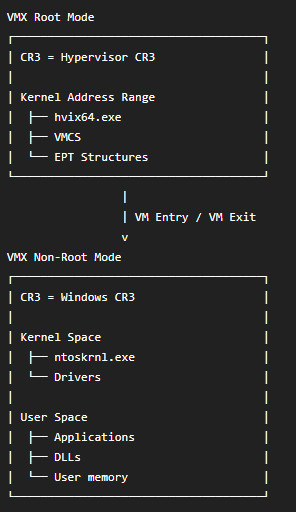

# HyperV-DXE
# This is not a fully working, but just an example how you access hv_launch with hooks.
By accessing hv_lauch from dxe driver, you can potentially, change the hypervisor setup, without detection from AC.

Windows seperate VMX ROOT AND VMX GUEST by EPT PAGING.

By changing it. You can have Software inside HyperV without any kernel driver ever will be able to detect it.

## Features

1. Relocate dxe image into `EfiRuntimeServicesCode` Bypass  `ExitBootServices memory terminate`
2. Hook `gBS->LoadImage` our dxe driver will get notificed then windows is booting:  `\EFI\Microsoft\Boot\bootmgfw.efi`
3. Hook `bootmgfw!ImgArchStartBootApplication`
4. Hook `winload!BlLdrLoadImage`
5. Receive `hvloader.dll` base and `hv.exe` base

   * `hv.exe` = `hvix64.exe` on Intel
   * `hv.exe` = `hvax64.exe` on AMD
6. Hook `hvloader!hv_launch`

# TODO BELOW HERE
7. Inject a PML4 into `HyperV cr3` , to map our driver inside  `HyperV Root Partition`
8. Hook `HyperV VmexitHandler `
9. On first VmExit: Inject the `EPT/NPT`, to hide our Image Physical address from `Windows Guest Memory`
10. Config `CPUID` backdoor as `HYPERCALL`. OFC make timming the same
